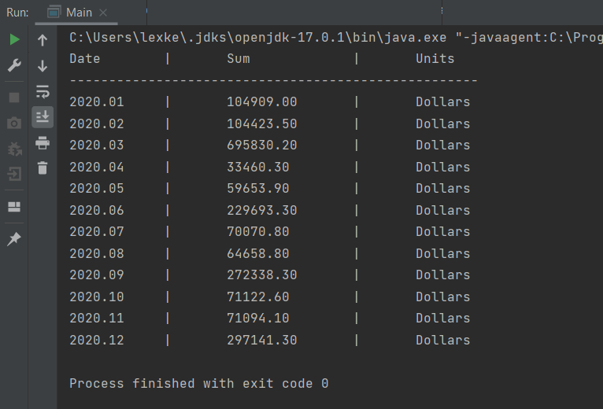
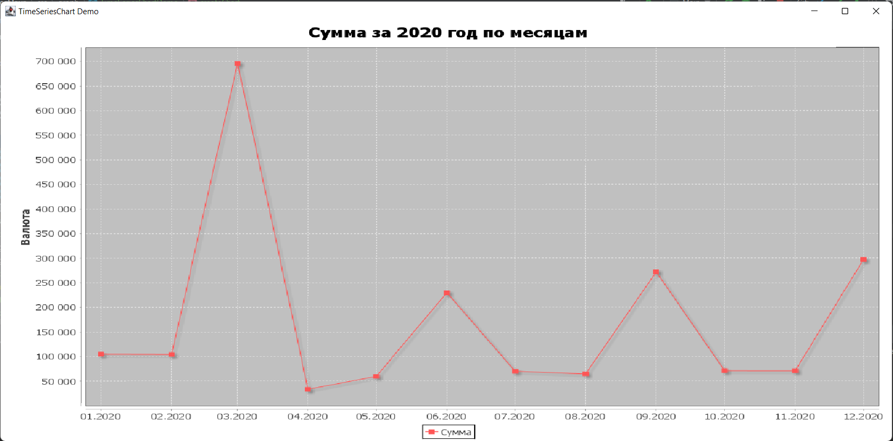
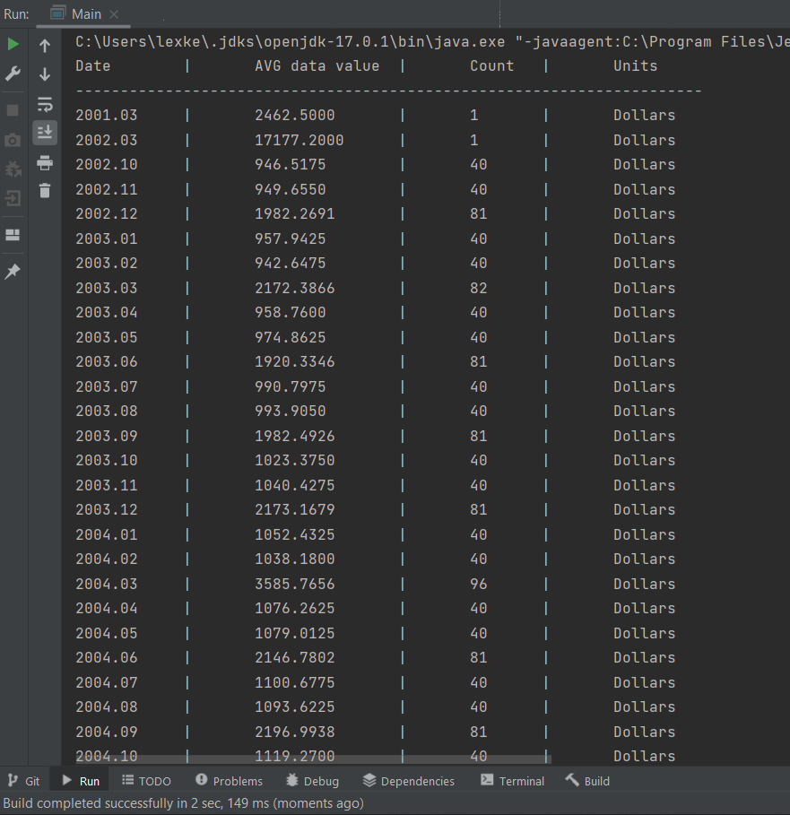
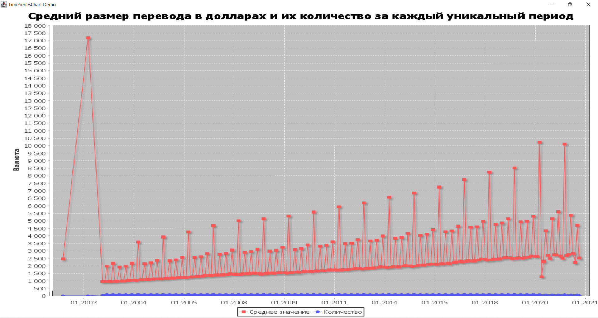
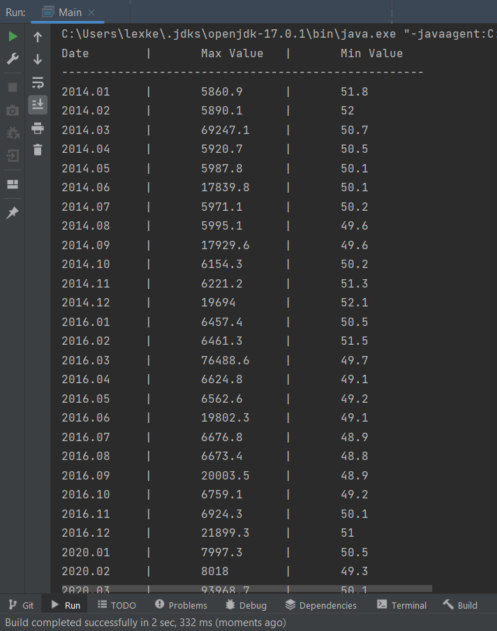
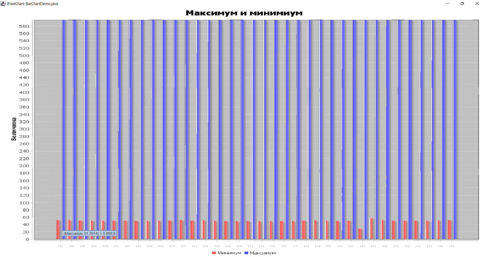
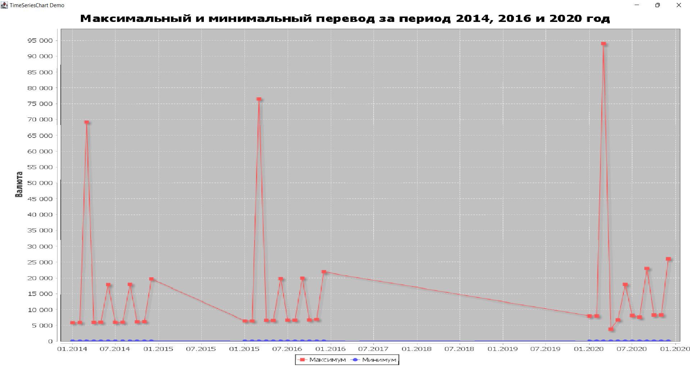

# TransfersProjectJava
TransfersProjectJavaForCource

1) Разработал набор классов с необходимым составом полей и методов для хранения и обработки всех данных, хранящихся в CSV-файле вашего варианта задания.

2) Распарсил данные в файле CSV, создал по ним набор объектов, заполнил все необходимыми полями.

3) Создал файл БД SQL Lite и подключил ее к проекту.

4) В БД создал набор таблиц (по 3-ей нормальной форме) согласно набору объектов.

5) Все данные из набора объектов сохранил в БД.

6) Сделал набор SQL-запросов к БД согласно своему варианту задания.

7) Полученные данные вывел в текстовом виде в консоль, а после числовые данные по заданию визуализировал в виде диаграмм,
скриншоты всех полученных данных и диаграмм прилагаются.

| Скриншот консоли:        | График:                             |
|:------------------------:|:-----------------------------------:|
||        |

|     Скриншот консоли:      |            График:            |
|:--------------------------:|:-----------------------------:|
|  |  |

|     Скриншот консоли:      |                            График:                             |
|:--------------------------:|:--------------------------------------------------------------:|
|  | |

Еще один график к 3 заданию
